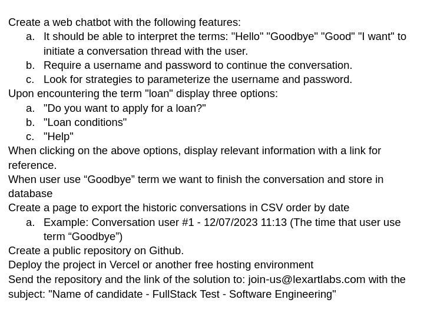
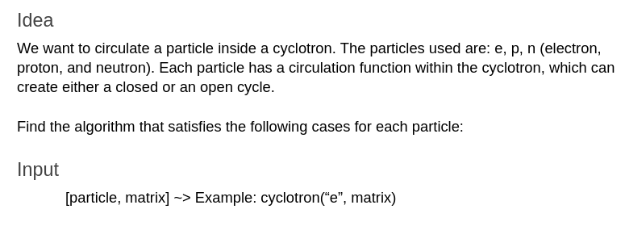
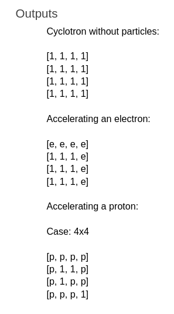
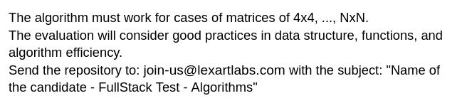

# LexArt Labs FullStack Test ✨

## Technologies and Tools used 🔥
  - React
  - Node.js (Javascript)
  - Express
  - Typescript
  - Socket io
  - SQLite
  - Prisma.io
  - Eslint
  - Env
  - SASS
  - Bcrypt

## About the Project

There are 2 challenges:

1. A web ChatBot:



2. An Algorithm problem:








## Running the ChatBot project 🚀
  
  #### Clone the project for your machine.
  ```
  git clone git@github.com:MatheusAraujoDev/lexart-labs-fullstack-test.git
  ```

 # BACKEND

```
├── prisma - Database schema.
├── src - Main folder
│    ├── botSteps
│           ├── stepZero - Waits for user initialization input, and asks user to type his username.
│           ├── stepOne -  Checks username length, and asks user to type the password.
│           ├── stepTwo -  Checks password length, and user is ready to interact with the chatbot (for example typing "loan").
│           ├── stepThree - If the user typed "goodbye" he will leave the chat and it will be saved in the database, if he typed "loan" a menu of options will appear, he can choose an option and then type goodbye to leave the chat and save in in the database.
│    ├── commonMessages - These are the error responses that the chat will respond to.
│    ├── commonTypes - Typescript commom types.
│    ├── prisma - prisma connection.    

```


  ### Requirements ⚙️
    - Nodejs (v18.x)
    - Package managment (npm)


1. Navigate to the backend folder using the command `cd backend`
2. Run the command `npm install`
3. Synchronize prisma with the database using the command:
```
npx prisma db push
```

4. Run the command to start your backend:
```
npm run dev
```

  # FRONTEND

```
├── src - Main folder.
│    ├── assets - index.html svg icon.
│    ├── components - components of the React application.
│    ├── services - axios base url.
│    ├── utils - usefull functions available for the entire application.
│    ├── socket - socket io base url.    

```

1. Navigate to the frontend folder using the command
```
cd frontend
```
2. Run the command
```
npm install
```
3. Run the command to start your frontend.
```
npm run dev
```
